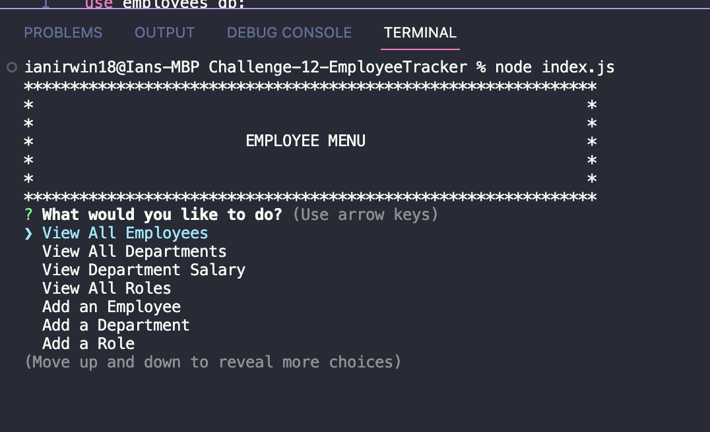

# Challenge-12-EmployeeTracker

## Table of Contents 📑

- [Description](#description)
- [Application Preview](#application-preview)
- [Installation](#installation)
- [Usage](#usage)
- [Links](#links)
- [Technologies](#technologies)
- [Questions](#questions)
- [License](#license)

## Description

Build a command-line application from to manage a company's employee database.

## Application Preview

    

## Installation

- Load schema.sql and seeds.sql
- Create .env file
- npm install
- node index.js

## Usage

- This application will allow users to view, add, and edit a their employee database.

## Links

- Github Repository: https://github.com/Ianirwin18/Challenge-12-EmployeeTracker

- Demo video: https://drive.google.com/file/d/1H8WaDYlrpRc8JFTPsBNq5Ht9menm-1X_/view?usp=sharing

## Technologies

- MySQL2
- Inquierer
- node.js

## Questions

- Github Link: https://github.com/Ianirwin18
- Email: Ianirwin18@gmail.com

## License

- Licensed under the: [MIT License](https://opensource.org/licenses/MIT)
